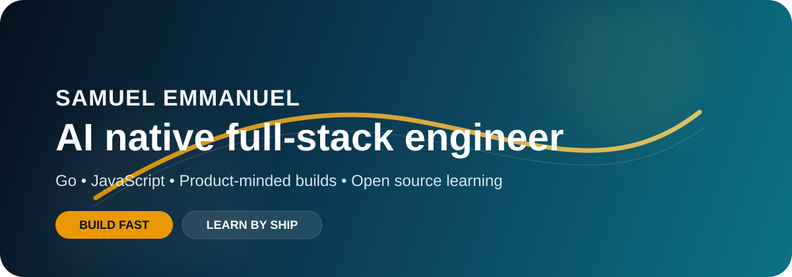

	

	

	
	
	

	I like turning ideas into working products, learning by shipping, and improving through real projects.

---

## About Me

I’m Samuel Emmanuel, an AI native full-stack engineer with a growing focus on Python, Go, JavaScript, and backend fundamentals. My background in Urban and Regional Planning gives me a systems-first way of thinking, and I bring that mindset into the tools and interfaces I build.

I enjoy shipping small but useful products, experimenting with new ideas, and using GitHub as a learning log.

---

## GitHub Pulse

	
	

	

---

## What I’m Good At

- Building interactive web experiences with HTML, CSS, and JavaScript
- Prompt Engineering
- Learning and practicing Python through hands-on projects
- Turning ideas into simple tools, demos, and prototypes
- Working cleanly with Git, GitHub, and collaborative workflows

---

## Featured Projects

These are the projects I’m actively building and learning from on GitHub.

<table>
	<tr>
		<td width="50%" valign="top">
			<h3>Go_journey</h3>
			
Learning process for my Go journey, with experiments, exercises, and notes as I grow into backend development.

			<ul>
				<li>Language exploration and practice</li>
				<li>Backend fundamentals</li>
				<li>Continuous learning log</li>
			</ul>
			
<a href="https://github.com/sammy-nug/Go_journey">View project</a>

		</td>
		<td width="50%" valign="top">
			<h3>100-days-of-solana</h3>
			
A long-form learning project focused on Solana, consistency, and deepening my understanding of blockchain development.

			<ul>
				<li>Daily learning workflow</li>
				<li>Solana ecosystem practice</li>
				<li>Progress over perfection</li>
			</ul>
			
<a href="https://github.com/sammy-nug/100-days-of-solana">View project</a>

		</td>
	</tr>
	<tr>
		<td width="50%" valign="top">
			<h3>Mario Pyramid Builder</h3>
			
An interactive CS50-inspired web app that renders a pyramid based on user input.

			<ul>
				<li>Dynamic input handling</li>
				<li>DOM manipulation</li>
				<li>Clean, minimal browser experience</li>
			</ul>
			
<a href="https://github.com/sammy-nug/Mario_Pyramid_Builder">View project</a>

		</td>
		<td width="50%" valign="top">
			<h3>quiz-game</h3>
			
A JavaScript quiz app built around simple interaction and fast feedback.

			<ul>
				<li>Frontend logic</li>
				<li>User interaction flow</li>
				<li>Lightweight game mechanics</li>
			</ul>
			
<a href="https://github.com/sammy-nug/quiz-game">View project</a>

		</td>
	</tr>
	<tr>
		<td width="50%" valign="top">
			<h3>ai-generated-landing-page</h3>
			
A landing page project focused on layout, visual polish, and fast iteration.

			<ul>
				<li>HTML structure</li>
				<li>UI presentation</li>
				<li>Product-style landing page design</li>
			</ul>
			
<a href="https://github.com/sammy-nug/ai-generated-landing-page">View project</a>

		</td>
		<td width="50%" valign="top">
			<h3>DecodeLabs-Internship</h3>
			
Work from my internship experience, showing how I apply what I’m learning in a real project setting.

			<ul>
				<li>Practical engineering work</li>
				<li>Team-based development</li>
				<li>Real-world implementation</li>
			</ul>
			
<a href="https://github.com/sammy-nug/DecodeLabs-Internship">View project</a>

		</td>
	</tr>
</table>

---

## Tech Stack

	
	
	
	
	

**Tools:** Git, GitHub, VS Code, Linux

**Strengths:** Debugging, problem solving, clean code, learning fast

---

## Currently Working On

- Sharpening my Python skills through real projects
- Building more polished frontend experiences
- Learning backend patterns by shipping and iterating
- Creating more open-source-friendly work

---

## Contact

- Email: [emmanuelsamuel259@gmail.com](mailto:emmanuelsamuel259@gmail.com)
- GitHub: [sammy-nug](https://github.com/sammy-nug)

---

> Always learning. Always building.
